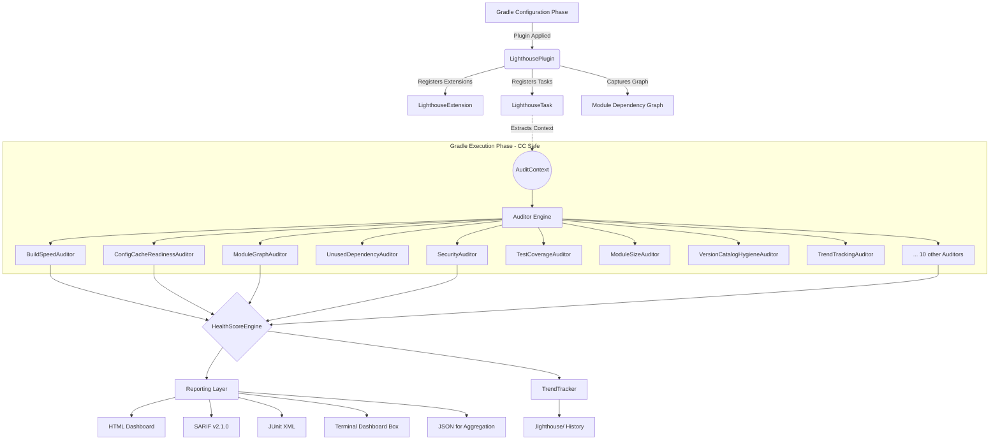
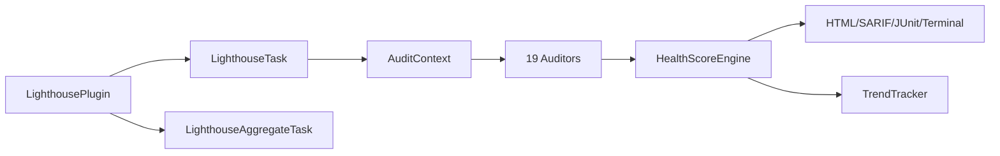

# High-Level Technical Design Document (HLD)

## 1. Project Overview

**Gradle Lighthouse** is an enterprise-grade Gradle diagnostic engine designed for Android and Kotlin Multiplatform (KMP) codebases. Its primary objective is to scale to 1M+ developers by providing instantaneous, architectural intelligence during the build process.

The plugin acts as an automated "Principal Engineer," intercepting the build pipeline to scan for structural flaws, performance bottlenecks, security vulnerabilities, and compliance violations — saving hundreds of engineering hours per year across large organizations.

**Plugin ID**: `io.github.dev-vikas-soni.lighthouse`
**Distribution**: [Gradle Plugin Portal](https://plugins.gradle.org/plugin/io.github.dev-vikas-soni.lighthouse)
**Version**: 2.0.2

## 2. System Architecture

The plugin runs locally on developer machines and in CI/CD environments seamlessly. It leverages Gradle's Configuration Cache and Isolated Projects model to ensure zero-overhead execution.

### 2.1 Core Components

1. **LighthousePlugin (Entry Point)**: Applies the DSL extension (`lighthouse { }`) and registers tasks. Captures module dependency graph for cycle detection.
2. **AuditContext (The Snapshot)**: A `Serializable` data class capturing the entire project state (dependencies, manifest, properties, source sets, module graph) during Configuration Phase. Fully decoupled from `org.gradle.api.Project`.
3. **Auditor Engine**: 19 stateless `Auditor` implementations organized by domain:
   - **Performance**: BuildSpeed, ConfigCacheReadiness
   - **Architecture**: ModuleGraph, ModuleSize
   - **Dependencies**: UnusedDependency, ConflictIntelligence, DependencyHealth, VersionCatalogHygiene, CatalogMigration
   - **Security**: Security
   - **Quality**: TestCoverage, ProguardSafety, ManifestAuditor
   - **Modernization**: Modernization, StartupPerformance, AppSize
   - **Compliance**: PlayPolicy, KmpStructure
   - **Observability**: TrendTracking
4. **Health Score Engine**: Exponential decay algorithm (`score = 100 × 0.98^impact`) with severity weights (FATAL=35, ERROR=15, WARNING=5, INFO=1).
5. **Reporting Layer**: HTML, SARIF, JUnit XML, colorful terminal dashboard, JSON (for aggregation).
6. **Trend Tracker**: Persists scores to `.lighthouse/` for historical comparison.

## 3. Design Decisions & Constraints

### 3.1 Configuration Cache Compatibility
**Problem**: Traditional plugins fail when Configuration Cache is enabled due to accessing `Project` during execution.
**Solution**: All project data is captured via `Provider` APIs during configuration and passed as `@Input` properties. Zero `Project` access in `@TaskAction`. Verified compatible with Gradle 8.10+.

### 3.2 Isolated Projects Compatibility (Gradle 9.x Ready)
**Problem**: Subprojects will be memory-isolated in Gradle 9.x.
**Solution**: Each module produces its own JSON report via `LighthouseTask`. The `LighthouseAggregateTask` only reads output directories declared as `@InputFiles`. No cross-project access.

### 3.3 Zero-Dependency Reporting
**Problem**: Enterprise networks block CDNs.
**Solution**: HTML reports are self-contained (inline CSS, system fonts, no JS CDN). Single-file portable reports.

### 3.4 Zero Configuration
**Problem**: Plugin adoption drops >80% when configuration is required.
**Solution**: All 19 auditors enabled by default. Plugin works with just `id("io.github.dev-vikas-soni.lighthouse")` — no `lighthouse {}` block needed.

### 3.5 Gradle Plugin Portal Distribution
**Problem**: JitPack requires `resolutionStrategy` hacks that block mass adoption.
**Solution**: Published to Gradle Plugin Portal with `com.gradle.plugin-publish`. Standard one-line `plugins { id(...) }` installation.

## 4. Execution Flow

1. **Installation**: `plugins { id("io.github.dev-vikas-soni.lighthouse") version "2.0.2" }` in build.gradle.kts.
2. **Configuration**: Gradle configures the graph. `LighthousePlugin` captures module state into serialized `@Input` properties. Module dependency graph is captured for cycle detection.
3. **Task Graph Ready**: `lighthouseAudit` placed in execution queue.
4. **Execution**: `LighthouseTask.execute()` reconstructs `AuditContext` from serialized inputs.
5. **Analysis**: Context passed to all enabled `Auditor` implementations (with error boundaries).
6. **Scoring**: `HealthScoreEngine` calculates score + rank + deductions.
7. **Terminal Dashboard**: Colorful box-drawing summary printed (score, delta, issues, next rank).
8. **Trend Persistence**: Score saved to `.lighthouse/{module}-history.json`.
9. **Report Emission**: HTML, SARIF, JUnit XML, JSON written to `build/reports/lighthouse/`.
10. **CI Gate**: If `failOnSeverity` is set, build fails on threshold violations.
11. **Aggregation (Optional)**: `lighthouseAggregate` combines all module JSONs into a global dashboard.

## 5. Module Dependency Graph

## 6. Non-Functional Requirements

| Requirement | Target |
|-------------|--------|
| Configuration Cache | ✅ Compatible |
| Isolated Projects | ✅ Ready |
| Gradle Version | 8.5+ |
| JDK | 17+ |
| Build Overhead | <2s per module |
| Zero External Deps | ✅ (no runtime dependencies) |
