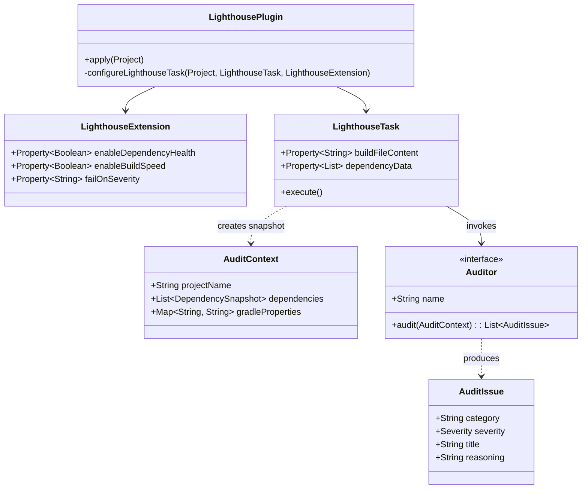

# Low-Level Technical Design Document (LLD)

This document serves as the implementation blueprint for core developers contributing to Gradle Lighthouse.

## 1. Class Diagram



## 2. Core Modules Detailed

### 2.1 The Snapshot Mechanism (`AuditContext.kt`)

The data snapshotting occurs within `LighthousePlugin.kt` utilizing Gradle `Provider` APIs.

```kotlin
// In LighthousePlugin.kt
task.dependencyData.set(project.provider {
    project.configurations.flatMap { config ->
        config.dependencies.map { dep ->
            "${config.name}|${dep.group}|${dep.name}|${dep.version}"
        }
    }
})
```
*Design Note*: We use serialized string pipes (`|`) or primitive lists rather than caching complex Gradle objects because standard Gradle objects are explicitly forbidden from being serialized by the Configuration Cache engine.

### 2.2 Auditor Interface (`Auditor.kt`)

Auditors are completely stateless data-in, data-out processors. They do not retain state between executions.

**Example implementation of a new Auditor:**
```kotlin
class SampleAuditor : Auditor {
    override val name: String = "Sample"

    override fun audit(context: AuditContext): List<AuditIssue> {
        val issues = mutableListOf<AuditIssue>()
        
        if (context.gradleProperties["android.useAndroidX"] != "true") {
            issues.add(AuditIssue(
                category = "Modernization",
                severity = Severity.ERROR,
                title = "AndroidX Disabled",
                reasoning = "...",
                impactAnalysis = "...",
                resolution = "...",
                roiAfterFix = "..."
            ))
        }
        return issues
    }
}
```

### 2.3 Reporting Engines

#### SARIF Generator (`SarifReportGenerator.kt`)
Generates OASIS SARIF v2.1.0 standard files.
*   **Rule extraction**: Maps unique `AuditIssue.title` to a SARIF `rule`.
*   **Location mapping**: Uses `AuditIssue.sourceFile` to point GitHub Advanced Security to the exact file containing the flaw.

#### JUnit XML Generator (`JunitXmlReportGenerator.kt`)
*   **Mapping**: Categories (Stability, Performance) map to `<testsuite>`. Individual findings map to `<testcase>`. `FATAL` severity maps to `<failure>`.

## 3. Extending the Plugin

To add a new Auditor, follow these strict guidelines:
1. Create a class implementing `Auditor` in `com.gradlelighthouse.auditors`.
2. Ensure the logic relies *only* on the `AuditContext` parameter.
3. If new data is required from the Gradle graph, modify `AuditContext` to hold that data, and update `LighthousePlugin` to extract it during the configuration phase.
4. Add a toggle for the auditor in `LighthouseExtension`.
5. Register the auditor inside the execution block of `LighthouseTask`.
