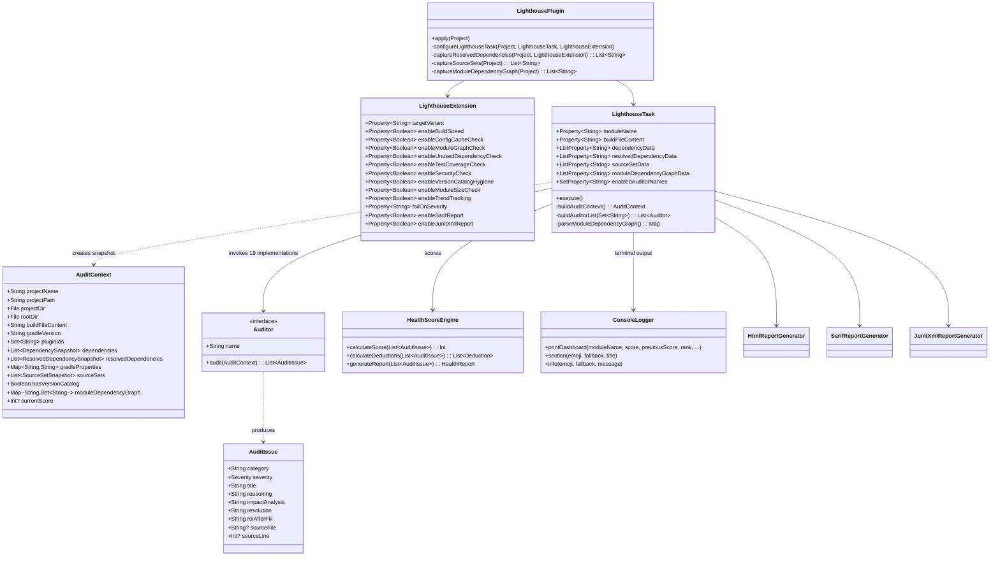

# Low-Level Technical Design Document (LLD)

This document serves as the implementation blueprint for core developers contributing to Gradle Lighthouse V2.0.

## 1. Class Diagram



## 2. Auditor Registry (V2.0)

| # | Auditor Class | Key (`enabledAuditorNames`) | Domain |
|---|--------------|----------------------------|--------|
| 1 | `BuildSpeedAuditor` | BuildSpeed | Performance |
| 2 | `ConfigCacheReadinessAuditor` | ConfigCacheReadiness | Performance |
| 3 | `ModuleGraphAuditor` | ModuleGraph | Architecture |
| 4 | `ModuleSizeAuditor` | ModuleSize | Architecture |
| 5 | `UnusedDependencyAuditor` | UnusedDependency | Dependencies |
| 6 | `DependencyAuditor` | DependencyHealth | Dependencies |
| 7 | `ConflictIntelligenceAuditor` | ConflictIntelligence | Dependencies |
| 8 | `CatalogMigrationAuditor` | CatalogMigration | Dependencies |
| 9 | `VersionCatalogHygieneAuditor` | VersionCatalogHygiene | Dependencies |
| 10 | `SecurityAuditor` | Security | Security |
| 11 | `TestCoverageAuditor` | TestCoverage | Quality |
| 12 | `ProguardSafetyAuditor` | Stability | Quality |
| 13 | `ManifestAuditor` | Stability | Quality |
| 14 | `ModernizationAuditor` | Modernization | Modernization |
| 15 | `StartupPerformanceAuditor` | Modernization | Modernization |
| 16 | `AppSizeAuditor` | AppSize | Modernization |
| 17 | `PlayPolicyAuditor` | PlayStorePolicy | Compliance |
| 18 | `KmpStructureAuditor` | KmpStructure | Compliance |
| 19 | `TrendTrackingAuditor` | TrendTracking | Observability |

## 3. Core Modules Detailed

### 3.1 The Snapshot Mechanism (`AuditContext.kt`)

Data snapshotting occurs in `LighthousePlugin.kt` using Gradle `Provider` APIs for CC safety:

```kotlin
// Dependencies — serialized as pipe-delimited strings
task.dependencyData.set(project.provider {
    project.configurations
        .filter { /* variant matching logic */ }
        .flatMap { config ->
            config.dependencies.filterIsInstance<ExternalDependency>().map { dep ->
                "${config.name}|${dep.group}|${dep.name}|${dep.version}"
            }
        }
})

// Module dependency graph — captures ProjectDependency references
task.moduleDependencyGraphData.set(project.provider {
    captureModuleDependencyGraph(project)  // "modulePath|dep1,dep2,dep3"
})
```

**Design Note**: Pipe-delimited strings are used instead of complex objects because Gradle's CC engine forbids serializing live Gradle API objects.

### 3.2 Auditor Interface (`Auditor.kt`)

Auditors are **stateless**, pure functions: `AuditContext → List<AuditIssue>`.

```kotlin
class MyNewAuditor : Auditor {
    override val name: String = "MyCheck"

    override fun audit(context: AuditContext): List<AuditIssue> {
        val issues = mutableListOf<AuditIssue>()
        // Analysis logic using ONLY context data
        if (context.gradleProperties["some.flag"] != "true") {
            issues.add(AuditIssue(
                category = "Performance",
                severity = Severity.ERROR,
                title = "Something is wrong",
                reasoning = "Technical explanation...",
                impactAnalysis = "Production impact...",
                resolution = "Step-by-step fix...",
                roiAfterFix = "Quantified benefit...",
                sourceFile = "gradle.properties"
            ))
        }
        return issues
    }
}
```

### 3.3 Terminal Dashboard (`ConsoleLogger.kt`)

V2.0 outputs a colorful, screenshot-worthy box using ANSI escape codes:

```
┌──────────────────────────────────────────────────────────┐
│  🏗️  Gradle Lighthouse — Score: 72/100 (+8)              │
│  Rank: Standard → Expert 🎯                              │
├──────────────────────────────────────────────────────────┤
│  ✅ Build caching enabled                                 │
│  ❌ KAPT detected — save 104h/year with KSP               │
│  ⚠️  3 unused dependencies                                │
├──────────────────────────────────────────────────────────┤
│  5 issues: 2 error · 2 warn · 1 info                     │
│  💡 Fix 2 issues to unlock Expert rank                    │
└──────────────────────────────────────────────────────────┘
```

Features: ANSI colors, score delta from previous run, next-rank motivation line.

### 3.4 Trend Tracking (`TrendTrackingAuditor.kt`)

Scores are persisted to `.lighthouse/{module}-history.json`:
```json
[{"score":65,"timestamp":"2026-04-28T10:30:00"},{"score":72,"timestamp":"2026-05-03T14:00:00"}]
```

The `getPreviousScore()` method reads the last entry for delta display.

### 3.5 Module Graph Analysis (`ModuleGraphAuditor.kt`)

- **Cycle detection**: DFS with recursion stack from current module
- **Feature coupling**: Regex-based detection of `feature` path segments
- **DOT output**: Written to `build/reports/lighthouse/module-graph.dot`

### 3.6 Reporting Engines

| Generator | Format | Consumer |
|-----------|--------|----------|
| `HtmlReportGenerator` | HTML5 (dark/light mode, responsive) | Browser |
| `SarifReportGenerator` | SARIF v2.1.0 | GitHub Security Tab |
| `JunitXmlReportGenerator` | JUnit XML (Surefire) | Jenkins, CI test tabs |
| `ConsoleLogger.printDashboard` | ANSI terminal | Developer terminal |

## 4. Extending the Plugin

To add a new Auditor:

1. Create a class implementing `Auditor` in `com.gradlelighthouse.auditors`
2. Logic must rely **only** on `AuditContext` (no filesystem access outside provided paths)
3. If new data is needed: add field to `AuditContext`, update `LighthousePlugin` to capture it, add `@Input` to `LighthouseTask`
4. Add a toggle `Property<Boolean>` in `LighthouseExtension` with `.convention(true)`
5. Add the mapping in `LighthousePlugin.enabledAuditorNames` provider
6. Register in `LighthouseTask.buildAuditorList()`
7. Write a test using `GradleRunner` + `@TempDir`

## 5. Build & Publish

```bash
# Build + test
./gradlew build

# Validate plugin descriptors
./gradlew validatePlugins

# Publish to Gradle Plugin Portal
export GRADLE_PUBLISH_KEY=xxx
export GRADLE_PUBLISH_SECRET=xxx
./gradlew publishPlugins
```

## 6. File Structure

```
src/main/kotlin/com/gradlelighthouse/
├── LighthousePlugin.kt              # Entry point, configuration capture
├── core/
│   ├── AuditContext.kt              # Serializable project snapshot
│   ├── Auditor.kt                   # Interface + AuditIssue + Severity
│   ├── ConsoleLogger.kt             # ANSI terminal output + dashboard
│   └── HealthScoreEngine.kt         # Scoring algorithm + ranks
├── extension/
│   └── LighthouseExtension.kt      # DSL configuration (17 toggles)
├── auditors/
│   ├── BuildSpeedAuditor.kt        # KAPT, caching, Jetifier, BuildConfig
│   ├── ConfigCacheReadinessAuditor.kt # CC, buildSrc, eager tasks
│   ├── ModuleGraphAuditor.kt       # Cycles, coupling, DOT graph
│   ├── UnusedDependencyAuditor.kt  # Import-based dead dep detection
│   ├── SecurityAuditor.kt          # Secrets, signing, wrapper, locking
│   ├── TestCoverageAuditor.kt      # Dark modules, JaCoCo, consumer rules
│   ├── ModuleSizeAuditor.kt        # LOC, public API, build file complexity
│   ├── VersionCatalogHygieneAuditor.kt # Hardcoded versions, bundles
│   ├── TrendTrackingAuditor.kt     # Historical score comparison
│   └── ... (10 more)
├── task/
│   ├── LighthouseTask.kt           # Core audit task (@TaskAction)
│   └── LighthouseAggregateTask.kt  # Multi-module dashboard
└── reporting/
    ├── HtmlReportGenerator.kt       # Self-contained HTML report
    ├── SarifReportGenerator.kt      # SARIF v2.1.0
    └── JunitXmlReportGenerator.kt   # JUnit XML
```
