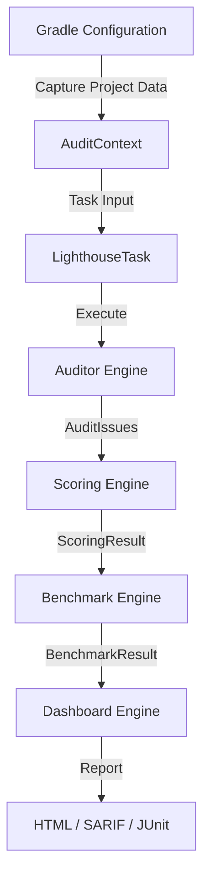

# System Architecture

Gradle Lighthouse is designed as a stateless, input-driven diagnostic engine hardened for modern Gradle features like **Configuration Cache** and **Project Isolation**.

---

## System Overview

The system is divided into four major sub-engines:

### 1. Finding Engine (Auditors)
A collection of 19+ stateless auditors. Each auditor is a pure function that takes an `AuditContext` (a serialized snapshot of the project) and returns a list of `AuditIssue` objects.

### 2. Scoring Engine (ModernHealthScoreEngine)
Transforms findings into a multi-dimensional health model.
*   Groups findings into `LighthouseCategory` (Architecture, Security, etc.).
*   Calculates category-level scores using a square root dampening curve.
*   Aggregates categories using weighted averages with "Weakest Link" protection.

### 3. Benchmark Engine (BenchmarkEngine)
Provides industry context by comparing the current project against a registry of `BenchmarkSnapshot` files. It calculates percentiles and direct deltas against reference projects like *Signal* and *Now in Android*.

### 4. Dashboard Engine (Reporting)
Generates self-contained, interactive HTML dashboards. It also produces CI-friendly outputs in SARIF v2.1.0 and JUnit XML formats.

---

## Audit Flow

The following sequence occurs during a typical `./gradlew lighthouseAudit` execution:

---

## Core Components

| Component | Responsibility |
|-----------|----------------|
| **LighthousePlugin** | Plugin entry point; registers DSL and wires tasks. |
| **AuditContext** | A serializable DTO containing dependencies, graph data, and properties. |
| **ScoringModels** | Data structures for `CategoryScore`, `HealthGrade`, and `ImprovementOpportunity`. |
| **BenchmarkRegistry** | Thread-safe manager for embedded and local benchmark snapshots. |
| **HtmlReportGenerator** | Zero-dependency template engine for dashboard generation. |

---

## Execution Constraints

*   **Zero Project Access**: Task actions have no access to `org.gradle.api.Project` to ensure 100% Configuration Cache compatibility.
*   **Thread Safety**: `BenchmarkRegistry` and `Auditors` are designed for parallel execution in large multi-module projects.
*   **No External Assets**: All HTML reports are fully self-contained (no CDNs) for compatibility with air-gapped CI environments.
