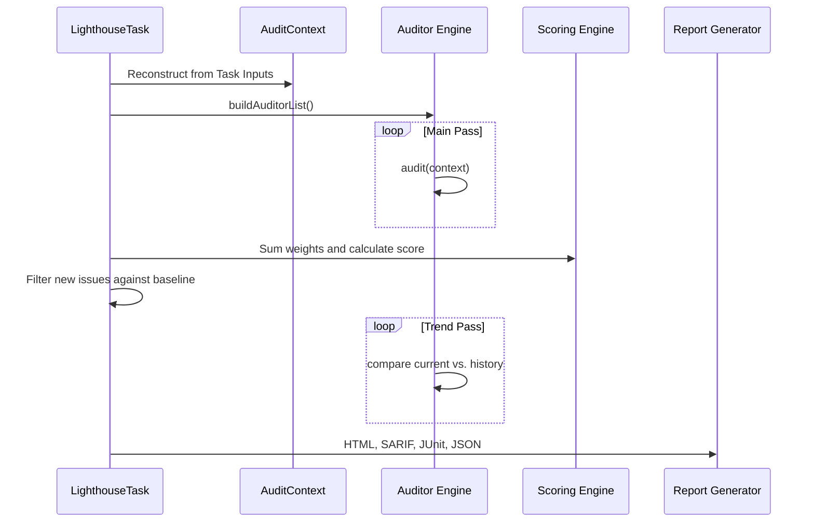

# The Audit Pipeline

Understanding how Lighthouse transforms raw build metadata into actionable intelligence.

## Pipeline Overview

The `lighthouseAudit` task follows a strictly defined execution sequence to ensure consistency and correctness.

## Step 1: Context Reconstruction
The task action begins by reconstructing the `AuditContext` from serialized string-pipes provided during configuration. This ensures the auditors work with structured data objects while keeping the Gradle task graph serializable.

## Step 2: Parallel Auditor Execution
Lighthouse partition auditors into two groups:
1. **Main Auditors**: 20+ specialized workers (Security, Performance, etc.) that generate the raw list of `AuditIssue` objects.
2. **Trend Auditors**: Workers that require the final score to calculate deltas.

## Step 3: The Scoring Pass
Once the issues are collected, the `HealthScoreEngine` calculates the final 0-100 score. It uses the **Square Root Deduction** formula to ensure that architectural impact is weighted correctly.

## Step 4: Baseline Filtering
If a `lighthouse-baseline.txt` exists, the engine calculates the fingerprint of every finding. Issues that match the baseline are suppressed from the console output and CI gates, but still appear in the HTML report (marked as "Baselined").

## Step 5: Multi-Format Reporting
The report generators produce multiple artifacts simultaneously:
* **JSON**: Used as input for the aggregate task.
* **HTML**: The primary developer-facing dashboard.
* **SARIF**: Industry-standard format for GitHub Security.
* **JUnit XML**: For CI/CD test results.

## Performance Optimization

* **Statelessness**: Every auditor is a pure function.
* **Lazy IO**: Reports are only written if the audit data has changed.
* **Minimal Memory Footprint**: Lighthouse uses string-based DTOs to avoid the overhead of heavy Gradle Model objects.
