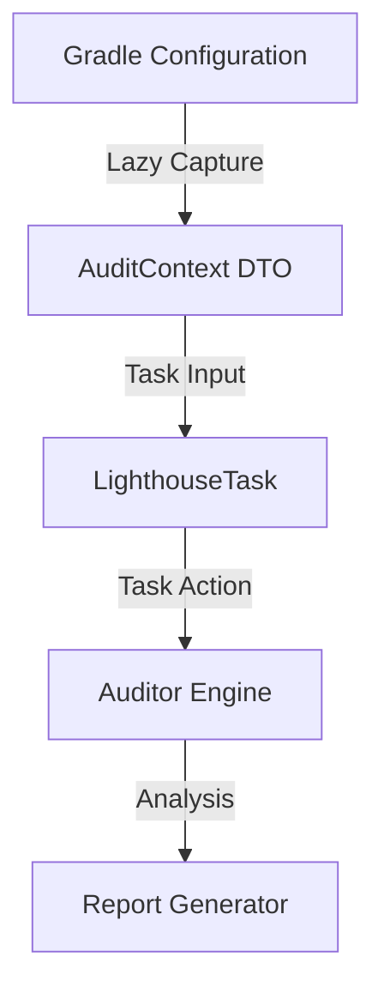

# Snapshot Architecture

Gradle Lighthouse is designed as a stateless, input-driven diagnostic engine. This design is what allows it to be 100% compatible with modern Gradle features like **Configuration Cache** and **Project Isolation**.

## The Snapshot/Memento Pattern

Most Gradle plugins access the heavy `Project` object during task execution. This is forbidden in modern Gradle because it breaks task isolation and parallel execution.

Lighthouse solves this by using a **Snapshot Architecture**:

1. **Configuration Phase**: `LighthousePlugin` uses lazy Gradle `Provider` APIs to capture only the necessary metadata (dependencies, properties, paths) into a serializable DTO called `AuditContext`.
2. **Execution Phase**: The `LighthouseTask` action runs. It has **zero** access to the `Project` object. It only sees the `AuditContext` snapshot.

## Why it matters

### 1. Blazing Fast Configuration
By using `Providers`, Lighthouse avoids resolving configurations during the configuration phase. This keeps your IDE sync times fast, even in massive multi-module repositories.

### 2. Configuration Cache Support
Since all task inputs are serializable primitives or data classes, Gradle can cache the entire task graph. The second time you run `./gradlew lighthouseAudit`, it starts almost instantly.

### 3. Thread Safety
Auditors are pure, stateless functions. This allows Gradle to run audits for multiple modules in parallel across all your CPU cores without any risk of race conditions or memory corruption.

### 4. Cross-Project Isolation
Lighthouse avoids using `allprojects` or `subprojects` during execution. Instead, the `LighthouseAggregateTask` uses a `ConfigurableFileCollection` to "pull" reports from child modules, adhering to the Gradle 9.0 Isolated Projects model.

## Implementation Details

The `AuditContext` class (found in `com.gradlelighthouse.core`) is the source of truth for all auditors. It contains:

* `dependencies`: List of all declared and resolved artifacts.
* `gradleProperties`: All flags from `gradle.properties`.
* `sourceSets`: Mapped paths to Kotlin/Java/Res directories.
* `moduleDependencyGraph`: An adjacency list of project-to-project dependencies.

For developers looking to contribute, this means your auditor **cannot** use the filesystem or Gradle APIs directly. You must use the data provided in the context.
