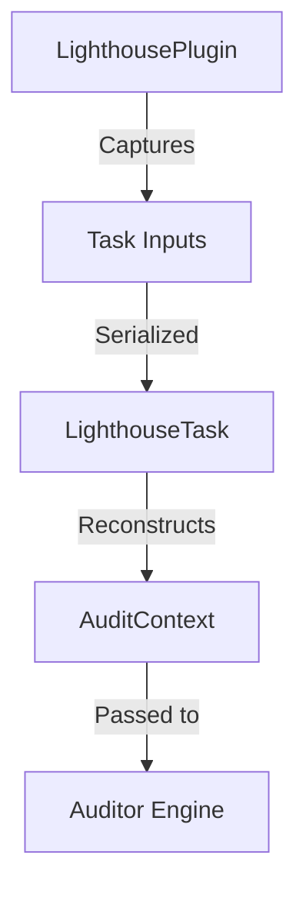

# Developer Architecture Guide

This document is for engineers looking to contribute to Gradle Lighthouse or understand its internal mechanics.

## Core Design Principles

1. **Snapshot First**: The analysis logic must be decoupled from the Gradle `Project` object.
2. **Stateless Logic**: Auditors must not hold mutable state.
3. **Lazy Execution**: Use Gradle `Providers` to defer expensive calculations.
4. **Zero CDNs**: All reporting assets must be inlined.

## The Snapshot Mechanism

Execution is split into two distinct phases:

### Phase 1: Configuration (Capture)
Classes: `LighthousePlugin`, `LighthouseExtension`.
Logic: Wires project metadata into task inputs.
* *Challenge*: AGP (Android Gradle Plugin) models are complex and often not serializable.
* *Solution*: Lighthouse maps AGP models into flat, serializable string-based POJOs (`DependencySnapshot`, `SourceSetSnapshot`).

### Phase 2: Execution (Analysis)
Classes: `LighthouseTask`, `AuditContext`, `Auditor`.
Logic:
1. `buildAuditContext()` reconstructs the structured model from serialized inputs.
2. `Auditor.audit(AuditContext)` is called for every active check.
3. `HealthScoreEngine` aggregates the results.

## Aggregation & Isolated Projects

`LighthouseAggregateTask` is designed to be compatible with Gradle 9.0 Project Isolation.
* It uses a `ConfigurableFileCollection` to pull `module-report.json` files from subprojects.
* It performs an **Iterative DFS** for cycle detection to avoid stack-overflow issues on deep graphs.

## Extension Points

* **New Auditor**: Implement `Auditor`, add to the registry in `LighthouseTask.buildAuditorList`.
* **New Report**: Implement a new generator in `.reporting` and call it from `LighthouseTask.execute`.
* **AI Fix**: Add logic to `LighthouseFixTask.applyAiFix`.

## Performance Considerations

* Avoid `walkTopDown()` in auditors where possible.
* Use `AuditContext.buildFileContent` instead of reading the file from disk repeatedly.
* Prefer `List` over `Set` for serialized inputs to maintain order.
